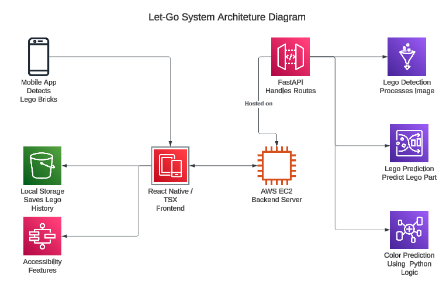
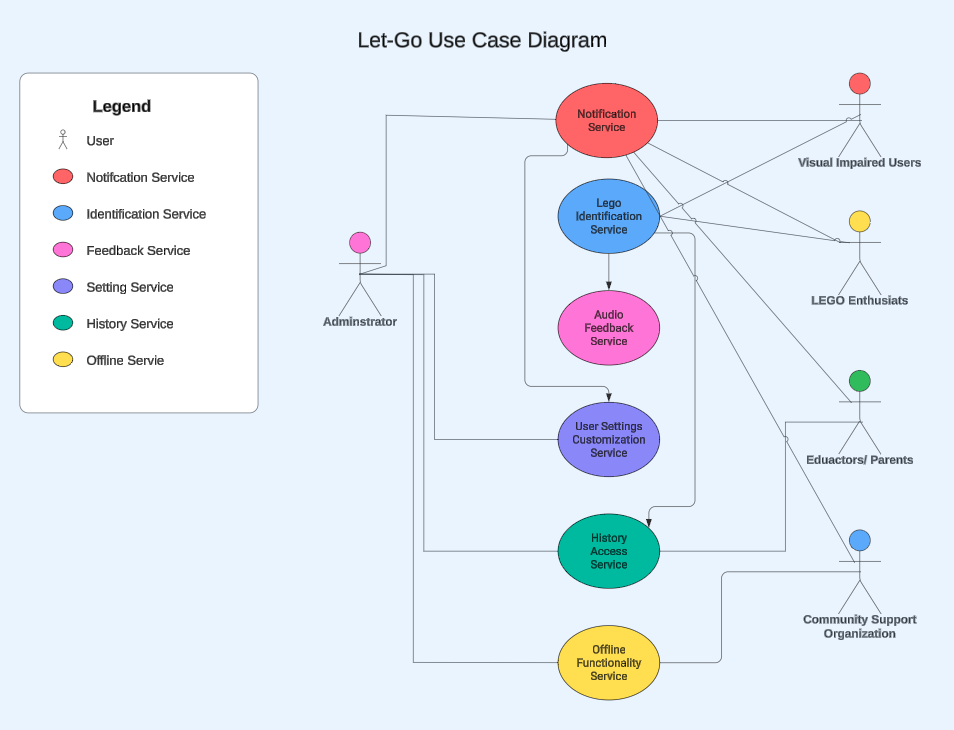
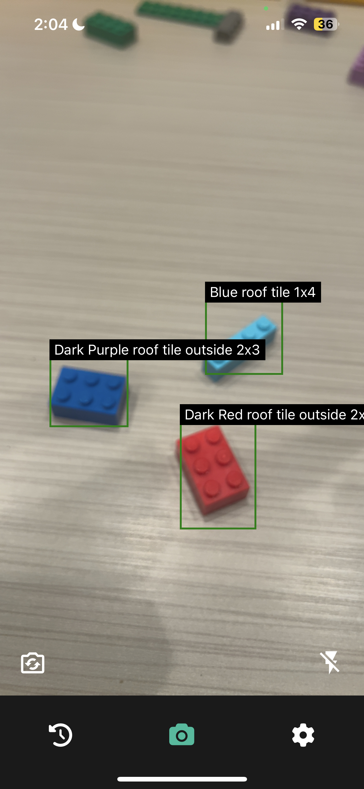

# LEGO Brick Identifier


A real-time LEGO brick detection app designed for accessibility, featuring advanced computer vision and user-friendly functionalities.

## 📚 Table of Contents
* [Overview](#overview)
* [Features](#features)
* [Installation](#installation)
* [Usage](#usage)
* [Project Architecture](#project-architecture)
* [Testing](#testing)
* [Contributing](#contributing)
* [License](#license)
* [Credits](#credits)

## 📝 Overview


The **LEGO Brick Identifier** is an innovative application leveraging **deep learning** and **computer vision** to detect and identify LEGO bricks in real-time. It is built with accessibility in mind, ensuring usability for individuals with color blindness or coordination challenges.

### Key Highlights


* Real-time identification of LEGO pieces
* Color detection for improved accessibility
* Text-to-speech functionality for auditory feedback

## ✨ Features


* **Real-Time Detection**: Utilizes DenseNet to identify LEGO pieces from live camera input
* **Color Identification**: Distinguishes LEGO piece colors with enhanced precision
* **Text-to-Speech Feedback**: Provides auditory outputs for detected bricks
* **User-Friendly Interface**: Accessible design with clear navigation and error recovery
* **Cross-Platform Compatibility**: Runs seamlessly on Android and iOS devices

## ⚙️ Installation

### Prerequisites
* Python 3.8+
* Node.js 14+
* npm or yarn package manager

### Steps
1. Clone the repository:
```bash
git clone https://github.com/yourusername/lego-brick-identifier.git
cd lego-brick-identifier
```

2. Install backend dependencies:
```bash
cd backend
pip install -r requirements.txt
```

3. Install frontend dependencies:
```bash
cd frontend
npm install
```

4. Set up and start the backend:
```bash
cd backend
uvicorn main:app --reload
```

5. Start the frontend:
```bash
cd frontend
npm start
```

## 🚀 Usage
1. Launch the backend server with FastAPI:
```bash
uvicorn main:app --reload
```

2. Start the frontend:
```bash
npx expo start --tunnel
```

3. Open your browser and navigate to `http://localhost:3000`

4. Point your camera feed to LEGO pieces for real-time detection and text-to-speech feedback

## 🛠 Project Architecture
The LEGO Brick Identifier app consists of the following key components:

* **Frontend**: Built with React for a responsive user interface
* **Backend**: Powered by FastAPI for real-time WebSocket communication
* **Model**: Utilizes DenseNet for robust and accurate LEGO detection

## 🧪 Testing

### Types of Testing
* **Performance Testing**: Evaluated under load for real-time detection with up to 100 concurrent users
* **Usability Testing**: Assessed for ease of use, navigation, and error recovery
* **Compatibility Testing**: Verified across Android and iOS devices

### Key Results
* Successfully detects most LEGO pieces with an 80% accuracy rate
* Passed tests for cross-platform compatibility and stability

## 🤝 Contributing
We welcome contributions to improve the app! Here's how you can get started:

1. Fork the repository
2. Create a new branch for your feature or fix
3. Commit and push your changes
4. Submit a pull request with a detailed explanation of your work

## 📄 License
This project is licensed under the MIT License. See the [LICENSE](LICENSE) file for more details.

## 💡 Credits
This project was developed by a team of dedicated students to provide a meaningful solution for LEGO enthusiasts and users with accessibility needs. Special thanks to everyone who contributed to its success!

## 🤝 The Dream Team


